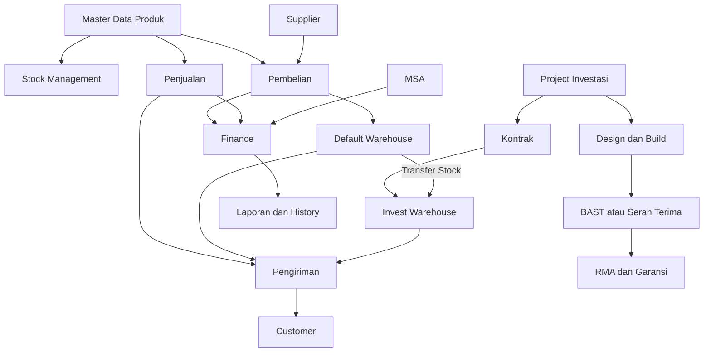

# Dokumentasi Sistem Manajemen Produk, Stock, dan Investasi

## 1. Overview Sistem
Sistem terintegrasi yang mengelola:
- Master Data Produk (multi kategori dan multi subkategori)
- Manajemen Stock (Default Warehouse dan Invest Warehouse)
- Pembelian dan Penjualan
- Finance dan Pembayaran
- Pengiriman
- Project Investasi (Design dan Build)
- Kontrak dan MSA
- RMA dan Garansi

Sistem mendukung alur bisnis dari pembelian barang ke supplier, pengelolaan stok, penjualan ke customer, hingga project investasi yang memiliki warehouse khusus.

## 2. Master Data Produk

### 2.1 Struktur Relasi Produk
Struktur:
- Kategori: kat-1, kat-2, kat-3
- Subkategori: subkat-1, subkat-2, subkat-3
- Produk: Product A, Product B

Relasi:
- 1 Produk dapat memiliki banyak Kategori
- 1 Produk dapat memiliki banyak Subkategori
- 1 Kategori dapat memiliki banyak Produk
- 1 Subkategori dapat memiliki banyak Produk

Relasi bersifat MANY TO MANY.

## 3. Stock Management

### 3.1 Stock Overview
Stock terdiri dari:
- Default Warehouse: warehouse utama, tempat stok awal pembelian masuk
- Invest Warehouse: warehouse khusus project, otomatis dibuat setelah kontrak project dibuat

### 3.2 Alur Stock
1. Pembelian -> Supplier -> Barang masuk Default Warehouse
2. Jika ada project investasi, sistem otomatis membuat Invest Warehouse
3. Stock transfer dari Default Warehouse ke Invest Warehouse
4. Pengiriman dilakukan dari warehouse sesuai kebutuhan

### 3.3 Pengiriman
Pengiriman memiliki:
- Data barang
- Warehouse asal
- Tujuan
- History pengiriman

## 4. Pembelian (Purchase Flow)

### 4.1 Alur Pembelian
Finance -> Supplier -> Pembelian -> Default Warehouse

Langkah:
1. Input transaksi pembelian
2. Approval jika diperlukan
3. Barang masuk Default Warehouse
4. Finance melakukan pembayaran ke supplier
5. History transaksi tersimpan

## 5. Penjualan (Sales Flow)

### 5.1 Alur Penjualan
Sales atau User -> Customer -> Penjualan -> Pengiriman -> Pembayaran

Langkah:
1. Sales membuat transaksi penjualan
2. Customer melakukan DP atau Full Payment
3. Barang dikirim dari warehouse
4. Finance menerima pembayaran
5. Status transaksi selesai

## 6. Project Investasi

### 6.1 Struktur Project
Project terdiri dari:
- Design dan Build
- PO
- Kontrak
- BAST atau Finish Project
- RMA atau Waktu Garansi

### 6.2 Alur Project Investasi
1. Project dibuat
2. Kontrak dibuat
3. Sistem otomatis membuat Invest Warehouse
4. Material dipindahkan dari Default Warehouse
5. Implementasi Design dan Build
6. BAST atau Serah Terima
7. Masa Garansi atau RMA jika ada kendala

## 7. Kontrak dan MSA

### 7.1 Kontrak
Kontrak mengikat project dan menjadi pemicu pembuatan Invest Warehouse.

### 7.2 MSA (Master Service Agreement)
MSA adalah perjanjian kerja sama, dapat memuat sharing profit, dan terkait payment MSA atau sharing profit investasi.

## 8. Finance
Finance bertanggung jawab atas:
- Pembayaran ke Supplier
- Penerimaan pembayaran dari Customer
- Pembayaran terkait MSA
- Laporan transaksi
- History pembayaran

Jenis pembayaran:
- DP
- Full Payment
- Termin
- Sharing Profit

## 9. Role dan Aktor Sistem
1. Admin. Kelola master data dan monitoring stock.
2. Sales atau User. Input penjualan dan kelola customer.
3. Finance. Kelola pembayaran dan laporan keuangan.
4. Supplier. Penyedia barang.
5. Customer. Pembeli atau owner project.
6. PIC MSA dan RMA. Handle kontrak MSA serta RMA dan garansi.

## 10. Ringkasan Integrasi Sistem
- Master Data digunakan oleh semua modul
- Stock terhubung ke Pembelian, Penjualan, dan Project
- Finance terhubung ke Pembelian, Penjualan, Project, dan MSA
- Project terhubung ke Stock dan Kontrak
- MSA terhubung ke Finance

## 11. Diagram Alur (Mermaid)

